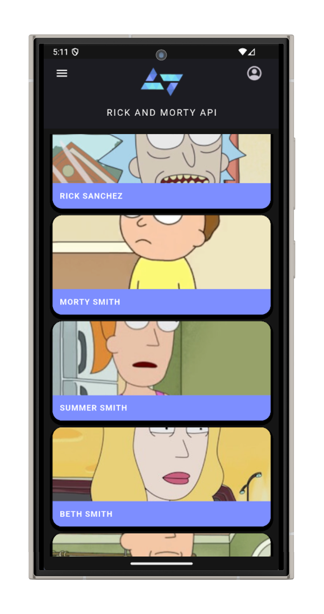
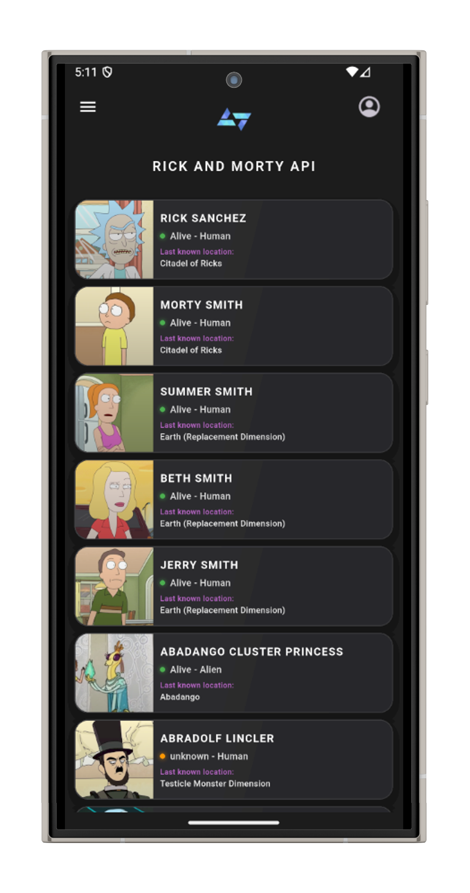

# Rick & Morty Flutter App

A modern Flutter application for collecting Rick & Morty characters through interactive games with dark UI and real-time mechanics.




## 🚀 Quick Start

### Prerequisites
- Flutter SDK 3.0+
- Dart SDK 3.0+
- Android Studio or VS Code

### Installation

```bash
# Navigate to app directory
cd myProject/my_app

# Install dependencies
flutter pub get

# Run the app
flutter run
```


### Backend Connection

The app connects to the backend API:
- **Android Emulator**: `http://10.0.2.2:3001`
- **iOS Simulator**: `http://localhost:3001`
- **Physical Device**: Update IP in service files

## 🎮 Core Features

### Game Modes
- **Daily Character Game** - Unlock random characters (10 coins, once daily)
- **Memory Card Game** - Match character pairs in 60 seconds (5 coins entry)
- **Daily Bonus** - Free coins every 24 hours

### User Experience
- **JWT Authentication** with secure token storage
- **Character Collection** with rarity system (Common → Legendary)
- **Dark Theme** with modern UI components
- **Real-time Coin Balance** synchronized with backend


## 📱 App Structure

```
lib/
├── main.dart                    # App entry point
├── models/
│   └── character.dart          # Data models
├── providers/
│   ├── auth_provider.dart      # Authentication state
│   └── theme_provider.dart     # UI theme management
├── screens/
│   ├── home_screen.dart        # Main dashboard
│   ├── login_screen.dart       # Authentication
│   ├── games_screen.dart       # Game hub
│   ├── memory_game_screen.dart # Memory game
│   └── my_characters_screen.dart # Collection
├── services/
│   ├── auth_service.dart       # API authentication
│   └── game_service.dart       # Game API calls
└── widgets/
    ├── custom_drawer.dart      # Navigation
    └── character_card_modern.dart # Character display
```


## 🎯 Key Screens

### Authentication
- **Login/Register** with email and password
- **Secure token storage** using SharedPreferences
- **Auto-login** on app restart

<!-- ADD IMAGE: Login and register screen screenshots -->

### Home Dashboard
- **Coin balance** display
- **Quick game access** buttons
- **Recent activity** overview
- **Navigation drawer** menu

<!-- ADD IMAGE: Home screen showing dashboard layout -->

### Games Hub
- **Available games** with cost display
- **Daily timers** for game availability
- **Performance stats** tracking

<!-- ADD VIDEO: Game selection and daily timer demonstration -->

### Character Collection
- **Grid layout** of unlocked characters
- **Rarity filtering** (Common, Rare, Epic, Legendary)
- **Character details** with Rick & Morty API data
- **Collection progress** tracking

<!-- ADD IMAGE: Character collection screen showing different rarities -->

### Memory Game
- **8 character pairs** (16 cards total)
- **60-second timer** with countdown
- **Performance-based rewards** (5-20 coins)
- **Flip animations** and match effects

<!-- ADD GIF: Memory game gameplay showing card flipping and matching -->

## ⚙️ Technical Features

### State Management
- **Provider pattern** for app-wide state
- **AuthProvider** for user authentication
- **ThemeProvider** for UI customization

```dart
class AuthProvider extends ChangeNotifier {
  User? _user;
  bool get isLoggedIn => _user != null;
  
  Future<void> login(String email, String password) async {
    // Authentication logic
  }
}
```

<!-- ADD IMAGE: Provider architecture diagram -->

### API Integration
- **RESTful API calls** to backend
- **JWT token authentication** 
- **Error handling** with user feedback
- **Network state management**

### UI Components
- **Custom character cards** with rarity indicators
- **Animated transitions** between screens
- **Dark theme** with green accent colors
- **Responsive design** for different screen sizes

<!-- ADD IMAGE: UI component showcase showing cards, buttons, and animations -->

## 🔧 Configuration

### API Endpoints

Update service files for your backend URL:

```dart
// services/auth_service.dart
static const String baseUrl = 'http://YOUR_BACKEND_IP:3001/api';
```

### Theme Customization

```dart
// providers/theme_provider.dart
static const Color primaryColor = Colors.green;
static const Color backgroundColor = Colors.black;
```

<!-- ADD IMAGE: Theme configuration showing color scheme -->

## 🎨 Game Mechanics

### Coin System
- **Starting balance**: 50 coins
- **Daily bonus**: 5 coins (24-hour cooldown)
- **Game costs**: Daily Game (10), Memory Game (5)
- **Rewards**: Variable based on performance

### Character Rarity
- **Common**: 60% chance (green border)
- **Rare**: 25% chance (blue border)  
- **Epic**: 10% chance (purple border)
- **Legendary**: 5% chance (gold border)

<!-- ADD IMAGE: Character rarity examples showing different border colors -->

## 📱 Platform Support

- **Android**: Material Design 3 components
- **iOS**: Cupertino design elements
- **Responsive layouts** for tablets and phones
- **Safe area handling** for different screen sizes

## 🧪 Testing & Debug

```bash
# Run tests
flutter test

# Debug mode with hot reload
flutter run --debug

# Release build
flutter build apk
```

<!-- ADD IMAGE: Testing setup and debug console -->

## 🚀 Build & Deploy

### Android APK
```bash
flutter build apk --release
```

### iOS Build
```bash
flutter build ios --release
```

<!-- ADD IMAGE: Build process and generated APK/IPA files -->

## 🔧 Common Issues

- **API Connection**: Check backend is running and IP is correct
- **Token Expired**: Clear app data and login again  
- **Build Errors**: Run `flutter clean && flutter pub get`
- **Hot Reload Issues**: Restart app in debug mode

<!-- ADD IMAGE: Troubleshooting guide with common error messages -->

## 🎯 Future Features

- [ ] Push notifications for daily bonuses
- [ ] Character trading between users
- [ ] Leaderboards and social features
- [ ] Offline mode support
- [ ] Additional game modes

---

**Built with Flutter 3.0+ • Material Design 3 • Provider State Management**